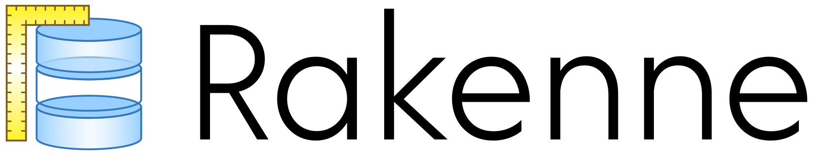

# 

Rakenne is a database modeling tool for command line written in [Crystal](https://crystal-lang.org/).

For now, It is a toy project to improve author's skills with the language and its various libraries. **It is very early stage and is not supposed to work (yet). Please don't use it in production.** :warning:

Note: _rakenne_ means _structure, construction_ in Finnish.

## Roadmap

* :arrow_right: **define a DSL for modeling database**
  * :arrow_right: [describe entity-relationship diagrams (ERD)](doc/erd-dsl.md) using MERISE notation
  * :arrow_right: [describe physical diagrams (PD)](doc/pd-dsl.md)
* :x: provide a command-line tool accepting commands for all operations
* :x: render models into diagrams with [GraphViz](https://www.graphviz.org/)
  * :x: ERD to MERISE MCD diagrams
  * :x: ERD to Chen notation diagrams
  * :x: PD to MERISE MLD diagrams
* :x: validate model
* :x: convert across different database reprentations
  * :x: convert ERD to PD
  * :x: convert PD to database specific SQL
  * :x: reverse-engineer database-specific SQL to PD
  * :x: reverse-engineer PD to ERD
* :x: support multiple physical models
  * :x: sql
  * :x: nosql (:warning: that requires de-normalizing)
* :x: support multiple SQL and NoSQL languages
  * :x: SQL: postgresql
  * :x: SQL: mariadb
  * :x: NoSQL: redis
  * :x: NoSQL: mongodb
  * :x: NoSQL: cassandra CQL (:warning: that requires knowing which requests will be made)

## Contributing

1. Fork it ( http://github.com/glenux/rakenne/fork )
2. Create your feature branch (`git checkout -b my-new-feature`)
3. Commit your changes (`git commit -am 'Add some feature'`)
4. Push to the branch (`git push origin my-new-feature`)
5. Create new Pull Request

## Authors & contributors

* [Glenn Y. Rolland](https://github.com/glenux) - creator and maintainer
* You? Fork the project and become a contributor!

## Sponsors

[Rakenne](https://github.com/glenux/rakenne) is an independent project whose development and maintenance is made possible thanks to the support of its patrons.

If you wish to join them and support the work of its author, just participate with this link:

**>>> [Become a patron or sponsor on Patreon](https://www.patreon.com/glenux) <<<**

## License

Rakenne is Copyright © 2020 Glenn ROLLAND. It is free software, and may be redistributed under the terms specified in the LICENSE.txt file.

## References

* [Wikipedia: Entity-relationship model](https://en.wikipedia.org/wiki/Entity%E2%80%93relationship_model)
* [Lucidchart: ER diagrams](https://www.lucidchart.com/pages/er-diagrams)
* [Youtube: 04.5 - Règles de vérification du MCD](https://www.youtube.com/watch?v=LR0Ip5Jenbk)

## Alternatives and inspirations

* [MoCoDo: a command-line ERD/PD renderer in python](https://rawgit.com/laowantong/mocodo/master/doc/fr_refman.html)
* [Schemalint: Lint database schemas](https://github.com/kristiandupont/schemalint)
* [SQLFairy: The SQL Translator](http://sqlfairy.sourceforge.net/)
